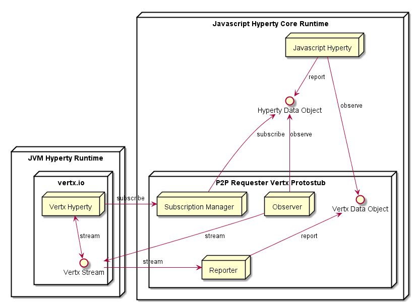

## P2P Protostub to connect the Browser Runtime to JVM Vertx Runtime

The P2P Vertx Stub is used by the Browser Runtime to directly connect with the Vertx Runtime by using Encrypted Web Sockets including a lib to support Vertx Event BUS on top of the Web Sockets.



The Protostub configuration includes:

* `host` the hostname or domain associated to the remote Vertx Runtime.
* `url` vertx Web socket server address
* `streams` an array of JSON Objects defining Vertx Event BUS addresses where the Reporter should set handlers to convert into reTHINK Data Objects:

  ```
  {
    stream: <event bus address>,
    resource: <hyperty resource type>,
    id: <stream identifier>,
    name: <stream name>
  }
  ```

The Stub includes the following components:

**Mini BUS Message listener**

Has a listener at minibus and processes received messages:

* `type = create` and `from = <runtimeUrl/sm>`: These are invitation messages that are forwarded to "Subscription Manager"
* all other messages (*to be confirmed*) are posted at Vertx Event BUS with `sendMessage()` to `message.to` address with callback to handle replied message which are posted in the reTHINK Minibus as response messages.

**Reporter**


Extends the ContextReporter (or have a lighter version?) service framework lib.

It provides a `create()` function that invokes `ContextReporter.create()` adding handlers to vertx event bus to new created data object URLs, where data received is written in the Data Object by calling `contextReporter.setContext(..)`.

The `create()` function is invoked for each stream defined at `config.streams` using as initial data, data returned by the vertx Hyperty when requested by sending:

```
{
  type: read
}
```


**Observer**

Provides a function to subscribe a certain Data Object URL. An event handler is set for the subscribed Data Object changes, to publish them in the Vertx Event BUS using as address the Data Object URL.

**Subscription Manager**

The Subscription Manager has a message handler for invitations that is called by the protostub bus listener for create messages coming from the runtime sync manager and targeting vertx hyperties.

These invitations are forwarded to Vertx Event BUS with callback to handle responses as well as subscription requests i.e. `eventBus.sendMessage(msg, callback)` where callback has the logic to call `invitationEvent.ack()` from the syncher (or should we directly send the 200 ok response?).

But before invitations are sent to vertx, the subscription manager set vertx handlers to the `from` of the invitations, ie `<objectUrl>/subscription`, to be prepared to receive subscription requests from `abstractHyperty.subscribe()` that is used to call the `Observer.subscribe()` function defined above.

On the other side the Subscription Manager has an event bus handler set at `<runtimeUrl>/sm` to receive create requests from [`abstractHyperty.create()`](https://github.com/reTHINK-project/dev-java-hyperty/blob/master/docs/abstract-hyperty.md#createdataobjecturl-observers-initialdata--function) that is used to call the `Reporter.create()` function defined above.
