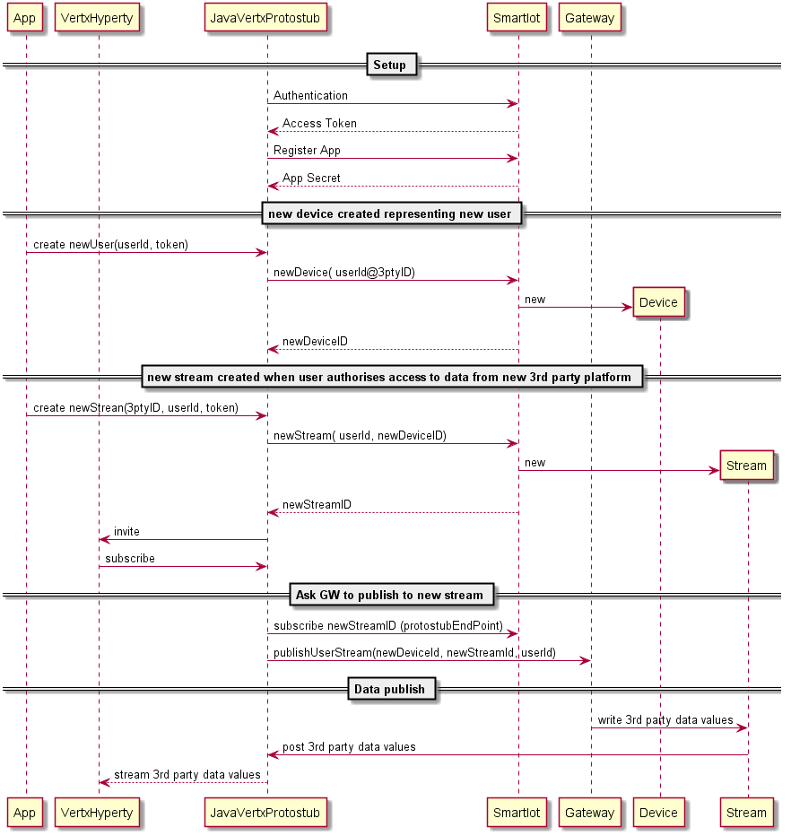

## Smart IoT Protostub

This is a Vertx Protostub component that makes the Bridge between Smart IoT message broker API and Vertx Event BUS.

See full [Smart IOT API spec](http://wiki.ptin.corppt.com/display/SMARTIOT/SmartIoT+REST+API#SmartIoTRESTAPI-Subscriptions)

