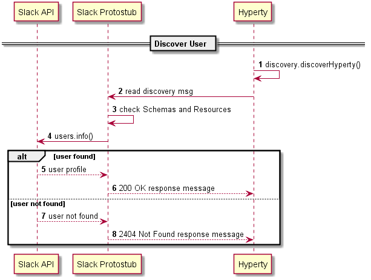
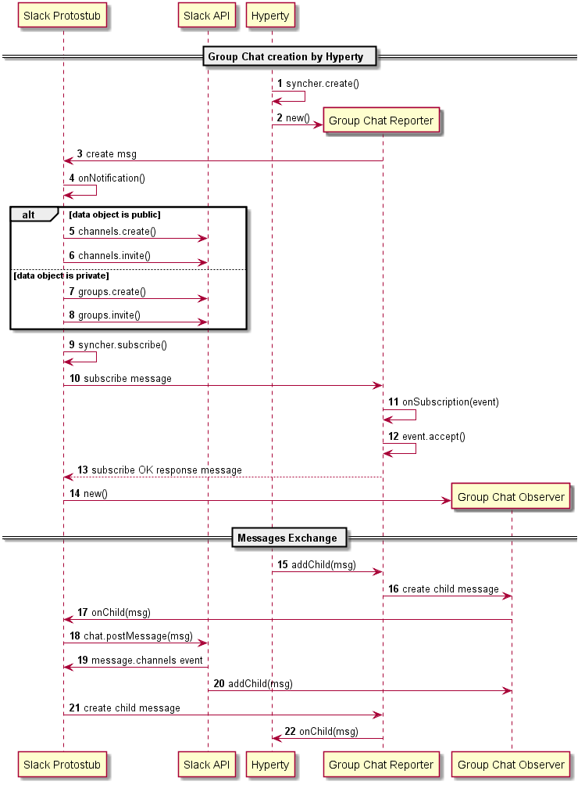
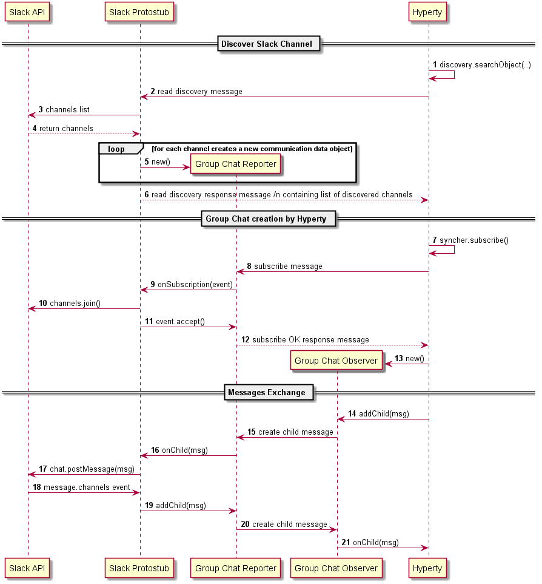

## Slack Protostub

### Slack user discovery

The Hyperty uses the discovery lib to discover a slack user.

Slack user URL syntax used as input for the discovery.discoverHyperty must be: `slack:\\<slackUserId>@<team>.slack.com`. Example: `slack:\\pchainho@rethink-project.slack.com`.

A [Read discovery message](https://github.com/reTHINK-project/specs/blob/master/messages/registration-messages.md#hyperty-instance-query-per-user-andor-per-resources-andor-per-object-scheme) reaches the Slack Interworking Protostub which will check:

- message.body.criteria.resources = ["chat"]
- message.body.criteria.schemes = ["comm"]

Then it parses the `message.body.resource` the slack user URL to get the Slack UserId and the Slack team, and queries the Slack API to check the user is member of the slack team. If user data is returned a [successful discovert response message is replied](https://github.com/reTHINK-project/specs/blob/master/messages/registration-messages.md#hyperty-instance-query-per-user-andor-per-resources-andor-per-object-scheme) with:

(*to be confirmed*)

- message.body.value.url = readMessage.body.resource
- message.body.value.user = readMessage.body.resource
- message.body.value.resources = readMessage.body.criteria.resources
- message.body.value.dataSchemes = readMessage.body.criteria.dataSchemes

If the API returns not found, a [response not found message](https://github.com/reTHINK-project/specs/blob/master/messages/registration-messages.md#registry-not-found-responses-1) is returned by the protostub.

### Slack Channels creation

The Hyperty creates a Group Chat and invites one or more users from a Slack team.

### Discover Slack Channels and Subscribe them

The Hyperty discovers existing channels from a Slack team and subscribes them.

### Direct Messages

Messages that are directly exchanged between users are treated as private Group Chats with only 2 members that are subscribed by the Hyperty.
