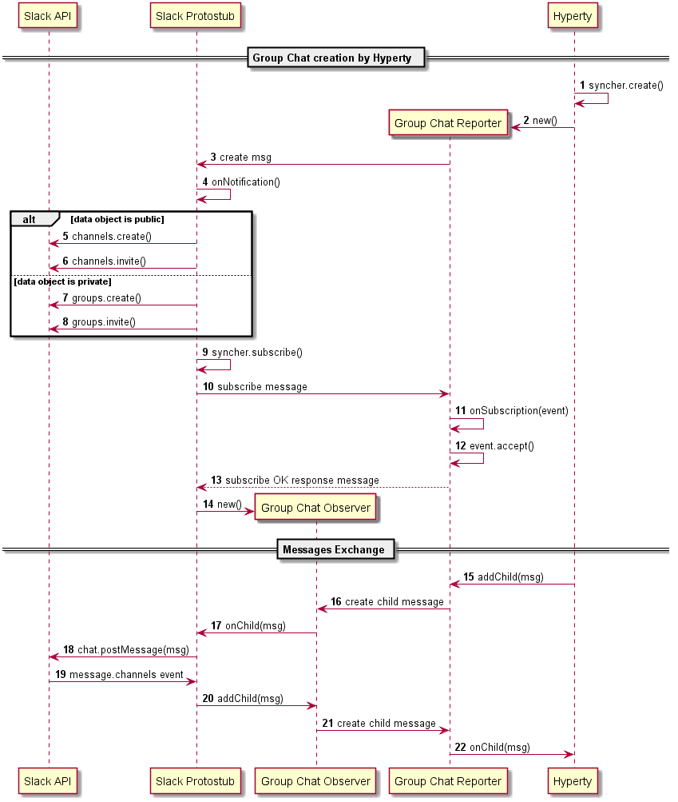

## Slack Protostub

### Slack Channels creation

The Hyperty creates a Group Chat and invites one or more users from a Slack team.

### Discover Slack Channels and Subscribe them

The Hyperty discovers existing channels from a Slack team and subscribes them.

### Direct Messages

Messages that are directly exchanged between users are treated as private Group Chats with only 2 members that are subscribed by the Hyperty.
